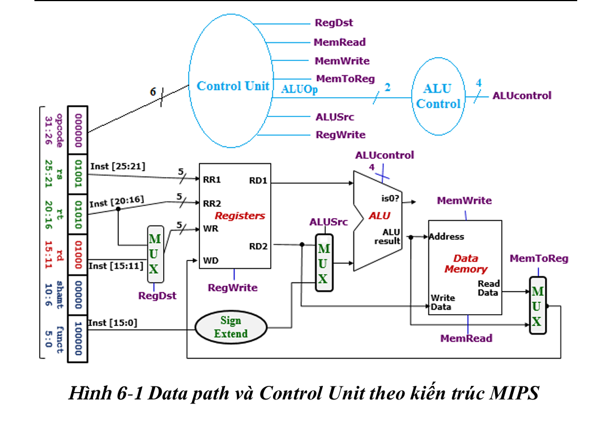
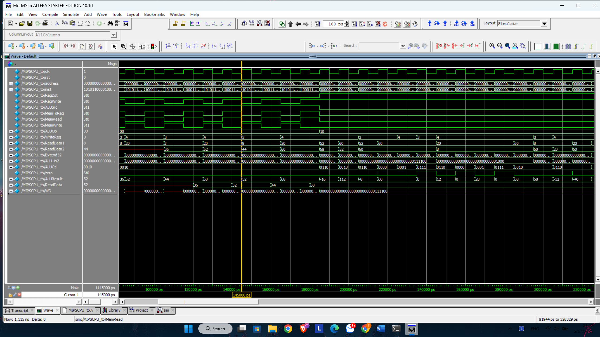

# Simple Processor - Verilog Project

## 📌 Mô tả
Dự án này thiết kế một bộ xử lý (Processor) đơn giản bằng ngôn ngữ Verilog HDL. Bộ xử lý bao gồm các khối: **Datapath**, **Control Unit**, và **ALU Control**. Processor có thể thực hiện một tập lệnh cơ bản tương tự kiến trúc MIPS.

## 🎯 Mục tiêu
Thiết kế và mô phỏng một bộ xử lý đơn giản có thể thực hiện các lệnh:
- `add $1, $2, $3`: cộng giá trị của thanh ghi $2 và $3, lưu vào $1
- `lw $1, 0($2)`: tải dữ liệu từ bộ nhớ (địa chỉ trong $2) vào $1
- `sw $1, 0($2)`: lưu dữ liệu từ $1 vào bộ nhớ (địa chỉ trong $2)

## 🧱 Cấu trúc hệ thống

Project gồm các khối chính:
- `MIPSCPU.v`: khối top-level kết nối và điều phối toàn bộ các thành phần của bộ xử lý.
- `IMem.v`: mô hình bộ nhớ lệnh (Instruction Memory) chứa các lệnh cần thực thi.
- `DataMemory.v`: mô hình bộ nhớ dữ liệu phục vụ cho các lệnh `lw`, `sw`.
- `ALU.v`: thực hiện các phép toán số học và logic như cộng, trừ,...
- `ALUControl.v`: quyết định phép toán ALU cần thực hiện dựa trên opcode và funct.
- `ControlUnit.v`: tạo ra các tín hiệu điều khiển chính dựa trên opcode của lệnh.
- `RegisterFile.v`: mô phỏng tập thanh ghi với khả năng đọc/ghi dữ liệu từ các thanh ghi.
- `SignExtended.v`: mở rộng số offset 16-bit thành 32-bit có dấu để dùng trong lệnh `lw` và `sw`.
- `Mux1.v`: multiplexer lựa chọn đầu vào cho ALU từ PC hoặc thanh ghi.
- `Mux2.v`: multiplexer lựa chọn giữa toán hạng thứ hai từ thanh ghi hoặc immediate.
- `Mux3.v`: multiplexer lựa chọn dữ liệu ghi ngược vào thanh ghi từ ALU hoặc Data Memory.


**Datapath và Control Unit theo kiến trúc MIPS**


## 📂 Cấu trúc thư mục

```text
simple_processor/
├── README.md
├── src/
│   ├── ALU.v
│   ├── ALUControl.v
│   ├── ControlUnit.v
│   ├── DataMemory.v
|   ├── IMem.v
|   ├── MIPSCPU.v
|   ├── Mux1.v
|   ├── Mux2.v
|   ├── Mux3.v
│   ├── RegisterFile.v
│   └── SignExtended.v
├── testbench/
│   └── MIPSCPU_tb.v
└── .gitignore
```

**Hình ảnh Waveform**



**Cách chạy mô phỏng nhanh:**
- **Bước 1** : mở terminal tại folder chứa project
- **Bước 2**: gõ lệnh `vlib work` (để tạo thư viện mô phỏng)
- **Bước 3**: gõ lệnh `vlog ./testbench/*.v` ( để compile file testbench)
- **Bước 4**: gõ lệnh `vsim MIPSCPU_tb` ( bắt đầu chạy mô phỏng)
